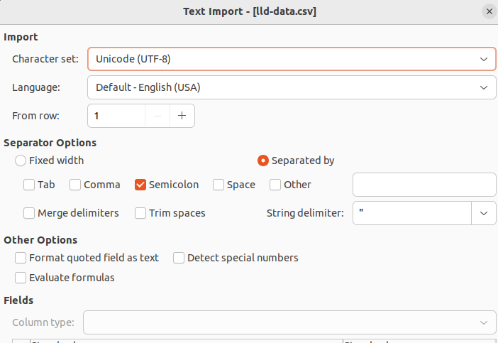

# Generating LLD holders report

```
npm i
npx ts-node src/lld-holders-report.ts > report.csv
```

Report is a CSV file that uses:

-   semicolon as a separator,
-   double quotes as string delimiter.

Example settings for importing into LibreOffice Calc:


